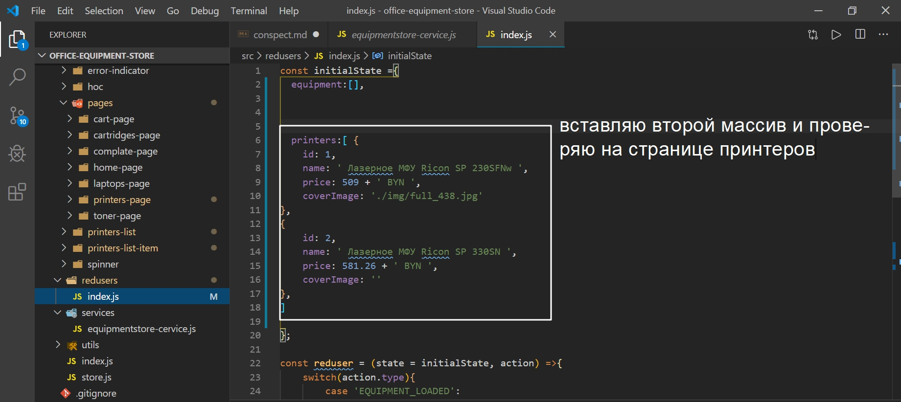

This project was bootstrapped with [Create React App](https://github.com/facebook/create-react-app).

## Available Scripts

In the project directory, you can run:

### `npm start`

Runs the app in the development mode.<br />
Open [http://localhost:3000](http://localhost:3000) to view it in the browser.

The page will reload if you make edits.<br />
You will also see any lint errors in the console.

### `npm test`

Launches the test runner in the interactive watch mode.<br />
See the section about [running tests](https://facebook.github.io/create-react-app/docs/running-tests) for more information.

### `npm run build`

Builds the app for production to the `build` folder.<br />
It correctly bundles React in production mode and optimizes the build for the best performance.

The build is minified and the filenames include the hashes.<br />
Your app is ready to be deployed!

See the section about [deployment](https://facebook.github.io/create-react-app/docs/deployment) for more information.

### `npm run eject`

**Note: this is a one-way operation. Once you `eject`, you can’t go back!**

If you aren’t satisfied with the build tool and configuration choices, you can `eject` at any time. This command will remove the single build dependency from your project.

Instead, it will copy all the configuration files and the transitive dependencies (Webpack, Babel, ESLint, etc) right into your project so you have full control over them. All of the commands except `eject` will still work, but they will point to the copied scripts so you can tweak them. At this point you’re on your own.

You don’t have to ever use `eject`. The curated feature set is suitable for small and middle deployments, and you shouldn’t feel obligated to use this feature. However we understand that this tool wouldn’t be useful if you couldn’t customize it when you are ready for it.

## Learn More

You can learn more in the [Create React App documentation](https://facebook.github.io/create-react-app/docs/getting-started).

To learn React, check out the [React documentation](https://reactjs.org/).

### Code Splitting

This section has moved here: https://facebook.github.io/create-react-app/docs/code-splitting

### Analyzing the Bundle Size

This section has moved here: https://facebook.github.io/create-react-app/docs/analyzing-the-bundle-size

### Making a Progressive Web App

This section has moved here: https://facebook.github.io/create-react-app/docs/making-a-progressive-web-app

### Advanced Configuration

This section has moved here: https://facebook.github.io/create-react-app/docs/advanced-configuration

### Deployment

This section has moved here: https://facebook.github.io/create-react-app/docs/deployment

### `npm run build` fails to minify

This section has moved here: https://facebook.github.io/create-react-app/docs/troubleshooting#npm-run-build-fails-to-minify

# Курсач начало.


# Обоснование выбора среды разработки

# Инициализация проекта

Данное приложение написано с помощью JavaScript библиотеки React. Для инициализации проекта проекта мне потребовалось установить данную библиотеку путем ввода в консоль команды npm-create-react-app office-equipment-store. Где npm-create-react-app стандартный запрос на установку данной библиотеки, а office-equipment-store это название проекта в котором я буду работать.

Для того что бы иметь доступ для редактирования файлов конфигурации WebPack, необходимо что бы в проекте появилась папка config. Для этого прописываю команду npm run eject и соглашаюсь с изменениями. В файле webpackDevServer.config.js я могу настраивать режимы разработки под себя.


После установки данного проекта нужно зайти в папку с проектом,C:\Users\Константин\Documents\GitHub\office-equipment-store, и установить еще некоторые зависимости.
Для установки зависимостей так же пишем в консоль npm install prop-types react-router-dom redux react-redux.
Где prop-types - для того что бы описывать свойства компонентов.
react-router-dom - для того что бы организовать роутинг в приложении.Т.е. переход по ссылкам в нашем single page aplication, одностраничном приложении. 
redux - ядро
react-redux - библиотека которая упрощает интеграцию react приложения с redux.

Так же для написания стилей я буду использовать препроцессор scss для установки котороко потребуется в консоли прописать команду npm install --save-dev node-sass sass-loader.
Флаг --save-dev означает что с данным пакетом мы будем работать в режиме разработки. Т.е. файлы scss не пойдут в prodaction. В production режиме будут скомпилированные css файлы.
node-sass - это движок.
sass-loader - с помощью этого loader происходит компиляция из scss в сss.

После установки зависимостей запускаем WebPack, а с ним и наше приложение, командой npm start. Мы должны попасть на localhost:3000 где и отобразится приложение. 
Все зависимости устанавливаются в файл package.json. 
Многие стандартные файлы в проекте мне не понадобятся. Поэтому я избавился от файлов в корне приложения packege-lock.json, yarn.lock. В папке src я оставил только index.js, остальные удалил. В папке public оставил только index.html. В index.html удалил не нужный код котоый был тем или иным образом связан с удаленными файлами. После этого в папке src в index.js удалил весь код т.к. я буду писать туда свой код.
После очистки проекта запускаю проект npm start и смотрю в консоль браузера для того что бы обнаружить и исправить оставшиеся ошибки если таковые имеются. 

# Создание структуры react-redux проекта

В этом разделе я создаю структуру директорий и инициализирую базовые компоненты которые нужны практически для каждого react-redux приложения. 

В папке src создаю иерархию папок. Понадобится папке services в которой будут хранится сервисы. Папка utils для маленьких функций compose. Папку components в которой будут хранится компоненты моего приложения. Данные три папки позволяют комфортно писать react приложение. Но я пишу не react приложение, а react-redux  приложение. 
Redux добавляет новые сущности и для этих новых сущностей мне нужны отдельные папки. Для Redux я создаю следующие папки. actions - сдесь будут находится все action creator, т.е. создатель действий.
Папка redusers - функция reduser в данной папке, по мере увеличения будет разбита на маленькие функции. Функции удобно хранить в файлах. Ну а файлы будут в папке redusers. 

В корне проекта создаю файл store.js в котором будет хранится код который инициализирует redux-store.

Далее я создаю несколько файлов для того что бы проинициализировать основные компоненты. В папке service создаю файл equipmentstore-cervice.js Поскольку  приложение будет показывать оргтехнику,его основной сервис будет называться  equipmentstore-cervice.js. Этот сервис будет отвечать за получение данных о технике. Поскольку мое приложение не такое большое я делаю это все в одном файле. Т.к. подключение к серверу в данном приложении отсутствует, данный service будет имитацией работы сервера. А если быть точнее данное приложение будет работать с заранее подготовленными данными. 

если нужно работать с сервером, то нужно будет переписать реализацию класса в этом файле.

Пока структура папок в и файлов в данном проекте выглядит таким образом.


```
export default class EquipmentStore{

    getEquipment(){
        return[];
    }
}

```

И так я создал класс который пока возвращает пустой массив оборудования. Пока эта функция синхронная. Постепенно я сделаю эту функцию асинхронной.

Структура компонентов. 

В первую очередь создаю компонент app. Это тот свмый корневой компонент который инициализирует приложение. Но кроме него нужно еще несколько вспомогательных компонентов. К примеру нужен компонент который отображает spinner пока данные загружаются. Или компонент который отображает ошибку. Или компонент error-boundry. Этот компонент отлавливает ошибки в JS коде в любом месте DOM дерева и входящих в него дочерних компонентов. 
Создаю папки для этих компонентов.

**Lf  описание этим папкам**


Кроме того создаю папку компонентов высшего порядка hoc **Higher-Order Components**.

И последний компонент который понадобится в базовом приложении это компонент контекст который будет поддерживать service. Ведь приложению нужно передавать  equipmentstore-cervice.js через контекст. Для того что бы этот механизм работал нужно создать компонент для контекста.
Называю папку equipmentstore-cervice-сontext. 
Ну и поскольку приложение будет состоять из нескольких страниц создаю папку pages в которой буду хранить компоненты страниц.

Получилась вот такая структура папок


В первую очередь я реализую компоненты app arror-indicator и spinner **Найди их реализацию**.


```
//App
import React from 'react';
import './app.scss';

const App = () =>{
    return<div>App</div>
};

export default App;

```

```
//index.js
import App from './app';

export default App;


```

```
//ErrorIndicator
import React from 'react';
import './error-indicator.scss';

const ErrorIndicator = () =>{
    return<div>Error!</div>;
};

export default ErrorIndicator;

```

```
//index.js
import ErrorIndicator from './error-indicator';

export default ErrorIndicator;

```

```
//spinner
import React from 'react';
import './spinner.scss';

const Spinner = () =>{
return<div>loading...</div>;
};

export default Spinner;

```

```
import Spinner from './spinner';

export default Spinner;

```

Далее создаем в error-boundry.  Сам по себе error-boundry ничего не отрисовывает. Ему не нужен css.
error-boundry - это компонент у которого метод жизненного цикла componentDidCatch. Поскольку у этого компонента есть метод жизненного цикла его обязательно нужно сделать компонентом классом.

```
//ErrorBoundry.js
import React, {Component} from 'react';
import ErrorIndicator from '../error-indicator';


export default class ErrorBoundry extends Component{
    
state ={
    hasError:false
};

    componentDidCatch(){
        this.setState({hasError: true});
    }
    
    render(){
if(this.state.hasError){
return<ErrorIndicator />;
}
return this.props.children;
    }
}

```

В импорте проиписываю откуда мне нужно проимпортировать библиотеку React, и в фигурных скобках с помощью метода деструктуризации вытаскиваем из библиотеки объект с которым я буду работать.

В ErrorBoundry понадобится два метода 

1. render
2. componentDidCatch. вызовется тогда когда в одном из компонентов, ниже по иерархии ErrorBoundry возникла ошибка, в методе render или в другом методе жизненного цикла компонента. И в componentDidCatch нужно сохранить это состояние и переключить ErrorBoundry в режим отображения  ошибки.
Для всего этого понадобится состояние state. Свойство состояния, которое я назвал hasError, изначально будет false.
Если же сработает componentDidCatch мы переведем его в true.

В render проверяю. Если есть ошибка, то пусть отрисовывается error-indicator. Если же ошибки нет, то пусть отрисовывается children элемент со всеми своими реквизитами.

**Ищи об этом инфу более подробно**

```
//index.js

import ErrorBoundry from './error-boundry';


export default ErrorBoundry;

```

Далее я реализую контекст equipmentstore-cervice-сontext. Это тот самый компонент который позволит передать сервис всем компонентам в приложении используя context API react. Создаю два файла equipmentstore-cervice-сontext.js и index.js. Scss не нужен поскольку контекст не будет ничего отрисовывать.

```
//equipmentstore-service-сontext
import React from 'react';

const {
    Provider: EquipmentstoreServicesProvider,
    Consumer: EquipmentstoreServicesConsumer
}= React.createContext();

export {
    EquipmentstoreServicesProvider,
    EquipmentstoreServicesConsumer
};

```

Мне понадобится два компонента которые называются Provider и Consumer. Эти компоненты создаются при помощи функции React.createContext(). Сразу эти два элемента я переименовываю Provider: EquipmentstoreServicesProvider и Consumer: EquipmentstoreServicesConsumer.

Далее для коректной работы этих компонентов я экспортирую их.

Для того что бы использовать их в приложении нужно пробросить их через index.js.

```

import {
    EquipmentstoreServicesProvider,
    EquipmentstoreServicesConsumer
} from './equipmentstore-cervice-сontext';

export{
    EquipmentstoreServicesProvider,
    EquipmentstoreServicesConsumer
};

```

Для того что бы использовать Consumer было удобнее нужно создать hoc компонент который будет называться with-equipmentstore-service.js и index.js с помощью которого будет делаться связка с нашим главным App компонентом.

```
//with-equipmentstore-service
import React from 'react';
import { EquipmentstoreServicesConsumer } from '../equipmentstore-service-сontext';

const withEquipmentstoreService = () => (Wrapped) => {

    return (props) => {
        return (
            <EquipmentstoreServicesConsumer>
                {
                    (equipmentstoreService) => {
                       return( <Wrapped  {...props} 
                        equipmentstoreService={equipmentstoreService}/>);
                    }
                }
            </EquipmentstoreServicesConsumer>
        );
    }
};

export default withEquipmentstoreService;

```

withEquipmentstoreService это функция которая возвращает функцию, которая в своих параметрах принимает компонент который мы будем оборачивать Wrapped. Т.е. в компоненте высшего порядка я создаю новый компонент. 
Далее я возвращаю функцию. Возвращаемая функция будет принимать props свойства. И данная функция будет возвращать кусок JSX кода.
В первую очередь, в возвращаемой функции, нужно использовать serviceConsumer для того что бы получить доступ к сервису. 
Оборачиваю Wrapped компонент в  EquipmentstoreServicesConsumer. Для того что бы получить данные из Consumer нужно передать в него render функцию. Это функция которая примет В качестве своего значения тот service который я ему передам через контекст.
Эта функция принимает на вход equipmentstoreService. Это тот сервис который я буду передавать. И возвращать данная функция будет тот компонент который я оборачиваю Wrapped. В параметры обертки прописываю с помощью spread оператора все свойства которые получил компонент т.е. {...props}. B так же в параметрах прописываю тот сервис который получаю из контекста equipmentstoreService={equipmentstoreService}.

Теперь для создания компонента который будет получать equipmentstoreService из контекста будет не сложно. Для этого достаточно обернуть любой существующий компонент, при помощи компонента высшего порядка withEquipmentstoreService.

Также пробрасываю через index.js

```
import withEquipmentstoreService from './with-equipmentstore-service';

export{
withEquipmentstoreService
};

```

Таким образом я создал все компоненты которые нужны для каркаса react-redux приложения.

Теперь я перехожу к redux компонентам. Я начну писать код с redusers. Reduser - это ядро приложения которая отвечает за логику обновления данных.
В папке redusers я создаю новый файл index.js

```
//index.js
const initialState ={
  equipment:[]  
};

const reduser = (state = initialState, action) =>{
    return state;
};

export default reduser;

```

reduser это обычная функция которая принимает два аргумента.**Добавь описание что такое state** Это текущий state с которым я сейчас работаю. Второй аргумент это action действие котороя я пытаюсь выполнить. После чего reduser должен вернуть новый state. Если мы вернем тот же state который получили,то это будет reduser который ни делает ничего.
По правилам redux если к нам не пришел state т.е. state = undefined, то тогда нужно вернуть initialState т.е. первоначальное состояние в приложении.
Для этого выношу initialState в отдельную константу. Этот state будет содержать массив который называется оборудование equipment. Далее по ходу разработки основной логики приложения можно будет добавить к initialState cart. это информация о том оборудовании которое пользователь положил в свою покупательскую карзину.

И в первом параметре функции reduser добавляю initialState к первоначальному состоянию в качестве значения по умолчанию. Nf им образом если state= undefined он будет иметь значение initialState.

Reduser готов, но использовать его без action не имеет ни какого смысла. Для того что бы reduser работал ему нужно добавить действие equipmentLoaded т.е. оборудование загружено. После этого я передам массив оборудования которое я получу от service который я использую вместо реального подключения к серверу. 
Для этого в функции reduser прописываю цикл switch. В параметрах указываю action.tipe. Прописывание action.type является обязательным параметром т.к. у каждого действия должен быть свой тип. И я буду поддерживать один тип действия EQUIPMENT_LOADED. И если в приложении произошло это действие то action.payload должен содержать новый массив книг которые мы загрузили. 
Соответственно нужно вернуть новое состояние в котором equipment это action.payload. И если не получается вернуть новый state мы мозвращаем текущий state.


```
const initialState ={
  equipment:[]  
};

const reduser = (state = initialState, action) =>{
    switch(action.type){
        case 'EQUIPMENT_LOADED':
        return {
            equipment: action.payload
        };
        default: return state;
    }
    
};

export default reduser;

```

Теперь поскольку у меня action мне потребуется функция которая будет создавать эти новые действия, та функция которая позволит более просто создавать объекты action. Для этого в папке action создаю index.js и создаю новую функцию.

```
const equipmentLoaded = (newEquipment) =>{

    return{
        type:'EQUIPMENT_LOADED',
        payload: newEquipment
    };

};

export{
    equipmentLoaded
};

```

Создаю функцию equipmentLoaded точно так же как называется действие в reduxStore.


Это не обязательно. Но лучше действие которое называется EQUIPMENT_LOADED будет называться функция которая будет называться точно так же equipmentLoaded. 

И так этой функции для работы нужен список нового оборудования (newEquipment). В этой функции возвращаю объект у которого type точно такой же как ожидает наш redux store


А payload это newEquipment.

Создание store.

Перехожу в файл store.js


```
import {createStore} from 'redux';
import reduser from './redusers';

const store = createStore(reduser);

export default store;

```

Что бы создать reduxStore нужно проимпортировать функцию createStore из пакета redux.
Rh ме того что бы проинициализировать store понадобится reduser и его точно так жи импортируем из папки redusers. Создаю store const store = createStore(reduser); По мере разработки этот файл будет расти.

И так у меня есть все маленькие строительные блоки для того что бы создать полноценное масштабируемое react-redux приложение. И сейчас я объеденю эти компоненты в одно приложение.
И так перехожу в корневой index.js.

```
// корневой index.js
import React from 'react';
import ReactDOM from 'react-dom';
import { Provider } from 'react-redux';
import { BrowserRouter as Router } from 'react-router-dom';

import App from './components/app';
import ErrorBoundry from './components/error-boundry';
import EquipmentstoreService from './services/equipmentstore-cervice';
import { EquipmentstoreServiceProvider } from './components/equipmentstore-service-сontext';

import store from './store';

const equipmentstoreService = new EquipmentstoreService();

ReactDOM.render(
    <Provider store={store}>
        <ErrorBoundry>
            <EquipmentstoreServiceProvider value={equipmentstoreService}>
                <Router>
                    <App />
                </Router>
            </EquipmentstoreServiceProvider>
        </ErrorBoundry>
    </Provider>,
    document.getElementById('root')
);


```

Как обычно начиная с импортов. Импортирую библиотеку react. ReactDom. Для того что бы дать компонентам доступ к redux-store импортирую Provider из библиотеки react-redux. Для того что бы реализовать routing мне потребуется BrowserRouter Сразу говорю что буду применять его как Router и говорю что буре его из react-router-dom. Это компоненты которые я получил из библиотек.

Далее я импортирую те компоненты которые я создал самостоятельно. Для начала импортирую главный элемент App. Далее понадобится ErrorBoundry. Для того что бы получить доступ к данным понадобится сервис EquipmentstoreService. Ну а для того что бы компоненты получили доступ к этому сервису нужен EquipmentstoreServiceProvider. И в конечном итоге понадобится store для того что бы управлять данными в приложении.

Далее все это я объединяю в одно приложение.
Для начала понадобится новый экземпляр EquipmentstoreService что бы с ним можно было работать и что бы его можно было передавать другим компонентам

```
const equipmentstoreService = new EquipmentstoreService();

```

Далее через ReactDOM.render отрисовываю дерево элементов на странице. Что именно и в каком порядке отрисовывать. Это очень важный момент который отрисовывает структуру приложения т.е. те возможности и тот функционал который будет доступен всем остальным компонентам внутри приложения. Поскольку это приложение управляется redux который является ценром логики управления на самом верхнем уровне отрендариваем компонент Provider из react-redux. Для того что бы Provider работал передаю ему store в качестве параметра который принимает store который я создал ранее в фале store.js.
Следующий компонет который я отрендерю это ErrorBoundry который я помещаю внутрь Provider.  ErrorBoundry я рендерю как можно выше в иерархии. Он обрамляет все компоненты ниже себя. Соответственно если в каком-нибудь компоненте ниже по иерархии возникнет ошибка, ErrorBoudry ее поймает и покажет красивый экран с ошибкой. ErrorBoundry я не ставлю в самый верх иерархии лишь потому что ему требуются данные из redux store.
Далее я помещаю в ErrorBoundry EquipmentstoreServiceProvider что бы все компоненты ниже от EquipmentstoreServiceProvider имели доступ к services. В параметры передаю значение value. Вкачестве значения передаю новый экземпляр equipmentstoreService. 
Теперь у всех компонентов ниже по иерархии будет доступ к значению equipmentstoreService.
Затем все что остается отрендерить это Router для того что бы все компоненты ниже имели доступ к функциональности роутинга. 
И в конечном итоге рендерю App.
В ReactDOM.render передаю второй аргумент document.getElementById('root') для того что бы добавить все отрендеренные компоненты в index.html в тег div с id = "root".
Вот так будет выглядеть файл который создает,запускает и инициализирует основные части приложения.

Далее для того что бы вывести массив с оборудованием который находится в папке service в файле equipmentstore-service.js, меняю код в App.js.

```
import React from 'react';
import './app.scss';
import {withEquipmentstoreService} from '../hoc';

const App = ({equipmentstoreService}) =>{
    console.log(equipmentstoreService.getEquipment());
    return<div>Пишу Курсовой проект</div>;
};

export default withEquipmentstoreService()(App);

```

Для начала импортирую withEquipmentstoreService. Далее я оборачиваю компонент App d компонент высшего порядка export default withEquipmentstoreService()(App); После того как я это сделал у компонента App в props появляется наш equipmentstoreService который мы прописываем в параметр функции App исполюзуя метод деструктуризации объктов.
И для проверки вывожу в консоль используя дескриптор get который вытаскивает все свойства из функции getEquipment в которой у меня находится пустой массив в компоненте equipmentstore-service.js.


Теперь у компонента Appесть доступ к services. Теперь я могу получать данные из компонента equipmentstore-cervice.
Теперь я заполню equipmentstore-cervice данными и выведу их в консоль.


Далее я оформляю Роутинг переход между станицами.

Удаляю прошлый код из компонента App поскольку в действительности компоненту App не нужен service. Это будет обязанность других компонентов.
Для того что бы роутиг заработал нужно создать пару компонентов для страниц. В папке pages создаю index.js, cart-page.js, cartridges-page.js, complate-page.js, home-page.js, laptops-page.js, printers-page.js, toner-page.js.
На примере одного компонента пишу такой код.

```
import React from 'react';


const HomePage = () =>{
    return<div>Home Page</div>;
};
export default HomePage;

```

Далее импортирую все компоненты в index.js и прописываю экспорт

```
import CartPage from './cart-page';
import CartridgesPage from './cartridges-page';
import ComplatePage from './complate-page';
import HomePage from './home-page';
import LaptopsPage from './laptops-page';
import PrintersPage from './printers-page';
import TonerPage from './toner-page';

export{
CartPage,
ComplatePage,
CartridgesPage,
HomePage,
LaptopsPage,
PrintersPage,
TonerPage
};

```

И в компоненте App настраиваю роутинг

```
import React from 'react';
import { Route, Switch } from 'react-router-dom';
import {
    HomePage,
    CartPage,
    CartridgesPage,
    ComplatePage,
    LaptopsPage,
    PrintersPage,
    TonerPage
} from '../pages';
import './app.scss';


const App = () => {

    return (
        <Switch>
            <Route path="/" component={HomePage} exact/>
            <Route path="/cart" component={CartPage} />
            <Route path="/cartridges" component={CartridgesPage} />
            <Route path="/laptops" component={LaptopsPage} />
            <Route path="/complate" component={ComplatePage} />
            <Route path="/printers" component={PrintersPage} />
            <Route path="/toner" component={TonerPage} />
        </Switch>
    );
};

export default App;

```

В первую очередь мне понадобится несколько компонентов, Route и Switch, из пакета react-router-dom. В компоненте App возвращаем Switch. Switch делает так что бы только один из внутренних Route срабатывал. Как только один Route сработал все остальные Route игнорируются. Это именно то поведение которое нужно в большинстве приложений.
При создании Route, для того что бы он заработал, передаю ему path. Первый Route  будет указывать на HomePage на прямой слэш. Далее указываем component и в качестве компонента я передаю одну из страниц component={HomePage} и на главном  Route указываю exact для того что бы только прямое совпадение с прямым слэш срабатывали.

Второй Route будет обрабатывать путь path="/cart",  будет отрисовывать component={CartPage} и параметр exact этому и последующим Route не нужен.
Теперь если в адресной строке вбить значение значение path, например /printers, то отобразится содержимое компонента printers.


Теперь я сделаю так что бы на printers отобразился список принтеров. Для того что бы отрендерить список я создам два компонента. Gt вый компонент будет называться printers-list.js , будет отвечать собственно за рендеринг списка. Ну а компонент printers-list-item будет отвечать за рендеринг одного элемента списка.
И начнем разработку с компонета printers-list-item и создаю наших типичных 3-ри файла.

```
//printers-list-item
import React, { Fragment } from 'react';
import './printers-list-item.scss';

const PrintersListItem = ({ printer }) => {
    const { name, price, coverImage } = printer;
    return (
        
        <Fragment>
            
            <span>{name}</span>
            <span>{price}</span>
        </Fragment>
    );


};

export default PrintersListItem;


```

PrintersListItem это компонент который принимает в качестве свойств printer. В const прописываем из каких данных состоит printer { name, price, coverImage }. По умолчанию присваиваем эти значения из printer. 
Далее достаю эти значения из printer. Lkz того что бы вернуть несколько фрагментов мне понадобится пакет Fragment из библиотеки react. Для этого импортирую Fragment из библиотеки react. 

В return возвращаю тег Fragment внутри которого будет содержаться span который отображает {name} а второй который отображает {price}.
Для лучшего импорта пробрасываю этот импорт через index.js

Теперь точно так же создаю printer-list. Как обычно создаю 3-ри файла для компонента.

```
import React, {Component} from 'react';
import PrintersListItem from '../printers-list-item';

import './printers-list.scss';

export default class PrintersList extends Component{
    render(){
        const {printers} = this.props;
        return(
            <ul>
                {
                    printers.map((printer) =>{
                        return (
                            <li key={printer.id}><PrintersListItem printer ={printer} /></li>
                        )
                    })
                }
            </ul>
        )
    }
};

```

printer-list более интересный компонент потому что как только он загружается он будет запрашивать данные. Соответственно для этого компонента нужен метод жизненного. Поскольку у компонента есть жизненный цикл этот компонент должен быть компонентом жизненного цикла. Поэтому из, блиотеки react потребуется импортировать пакет Component. 
Внутри класса я реализую метод render. Для того что бы отрендерить данные нужно получить список книг. Это будет свойство printers в котором будет содержаться массив принтеров которому мы присвоим по умолчинию метод props с помощью которого я и вытащу все данные из массива.
Далее  я возвращаю этот самый отрендеренный массив в виде элементов списка.

```
<ul>
                {
                    printers.map((printer) =>{
                        return (
                            <li key={printer.id}><PrintersListItem printer ={printer} /></li>
                        )
                    })
                }
            </ul>

```

 Для его работоспособности import PrintersListItem from '../printers-list-item';

 Для каждой книги я возвращаю элемент li внутри которого будет компонент PrintersListItem которому я передаю своство printer ={printer}. Для импорта id  элементов в теге li  пишу атрибут key и через метод деструктуризации вытаскиваю порядковое значение id каждого элемента списка.

 Экспортирую в index.js

 ```
import PrintersList from './printers-list';

export default PrintersList;

 ```

 И для тестовой проветки меняем код в printers-page.js.

```
import React from 'react';
import PrintersList from '../../printers-list';

const PrintersPage = () =>{
    return(
        <PrintersList printers={[ {
            id: 1,
            name: ' Лазерное МФУ Ricon SP 230SFNw ',
            price: 509 + ' BYN ',
            coverImage: './img/full_438.jpg'
        },
        {
            id: 2,
            name: ' Лазерное МФУ Ricon SP 330SN ',
            price: 581.26 + ' BYN ',
            coverImage: ''
        },
    ]} />
    );
};

export default PrintersPage;

```

# Чтение данных из redux-store

Для того что бы подключить компонент к redux-store мне необходимо использовать компонент высшего порядка который называется Connect. Импортирую его

```
//printers-list.js
import React, {Component} from 'react';
import PrintersListItem from '../printers-list-item';
import {connect} from 'react-redux';

import './printers-list.scss';

 class PrintersList extends Component{
    render(){
        const {printers} = this.props;
        return(
            <ul>
                {
                    printers.map((printer) =>{
                        return (
                            <li key={printer.id}><PrintersListItem printer ={printer} /></li>
                        )
                    })
                }
            </ul>
        )
    }
};

export default connect()( PrintersList);

```

И так connect эта функция которая создает новый компонент. Для того что бы ее использовать нужно обернуть существующий компонент вот таким вот образом

```
export default connect()(PrintersList);

```

сonnect это функция которая возвращает функцию. Поэтому в первую функцию connect я должен передать конфигурацию как именно я хочу подключить PrintersList. А во вторую функция я передаю функцию которую хочу вернуть PrintersList. Вся эта констукция

```
export default connect()(PrintersList);

```

Вернет новый компонент который уже будет знать о redux-store и сможет с ним работать. 

Но для того что бы работать с redux-store нужно определить конфигурацию connect.
Первая часть конфигурации описывает какие данные компонент будет получать из redux-store. Форма store простая


Именно этот массив я и хочу передать в компонент PrintersList. B для того что бы это сделать нужно определить функцию которая называется mapStateToProps эта функция принимает state и возвращает объект там где ключи это будут названия свойств которые я присвою компоненту.

```
const mapStateToProps = () =>{
    return {
        printers:state.printers
    };
};

```

Моэно эту функцию написать еще проще 


```
const mapStateToProps = ({printers}) =>{
    retutn{printers};
};

```

Ну и конечно же mapStateToProps нужно передать в функцию connect.

```

import React, {Component} from 'react';
import PrintersListItem from '../printers-list-item';
import {connect} from 'react-redux';

import './printers-list.scss';

class PrintersList extends Component{
    render(){
        const {printers} = this.props;
        return(
            <ul>
                {
                    printers.map((printer) =>{
                        return (
                            <li key={printer.id}><PrintersListItem printer ={printer} /></li>
                        )
                    })
                }
            </ul>
        )
    }
};

const mapStateToProps = ({printers}) =>{

    return{printers};
    
    };

export default connect(mapStateToProps)( PrintersList);

```

Теперь мой компонент будет получать принтеры из redux-store. 
Убираю тестовые данные из printers-page.js.

Беру данные из 


и вставляю второй массив в




Теперь данные из reduser попадают в printers-list.js и отображаются на экране.
  
